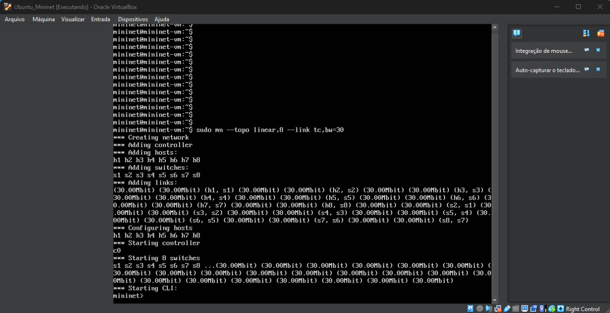
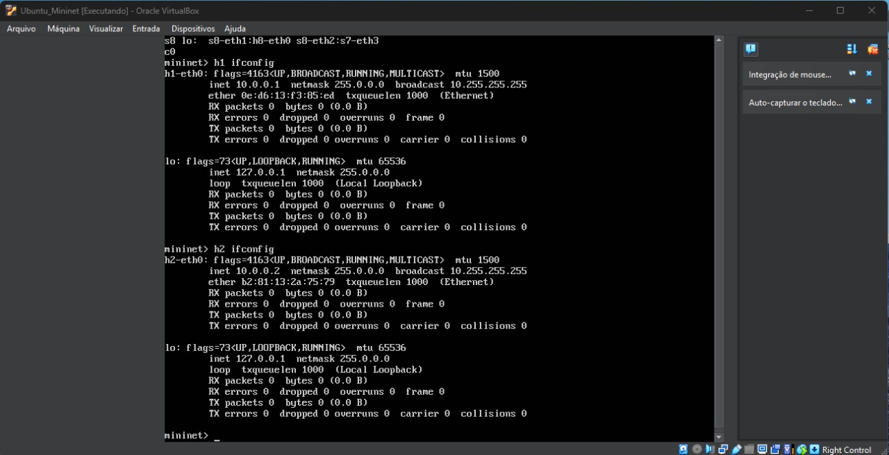
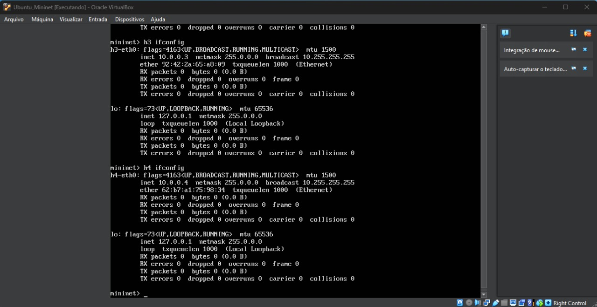
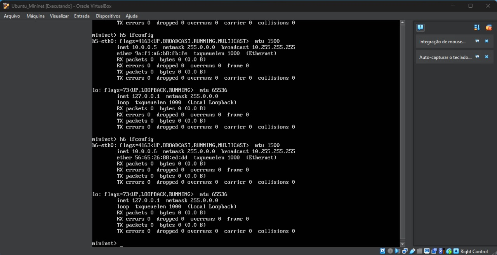
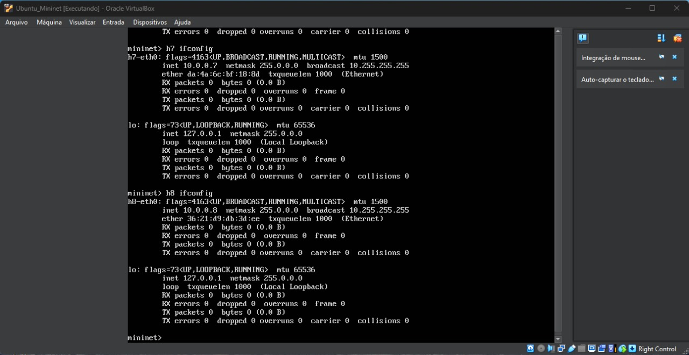
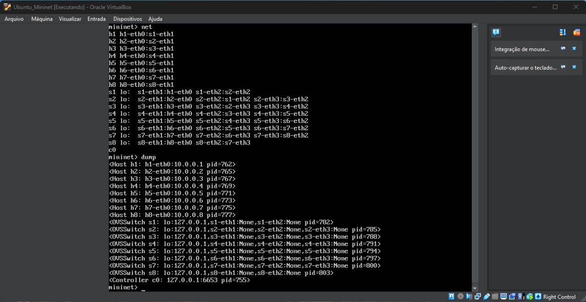
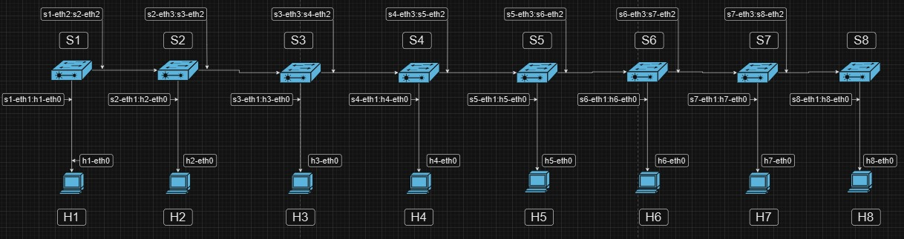
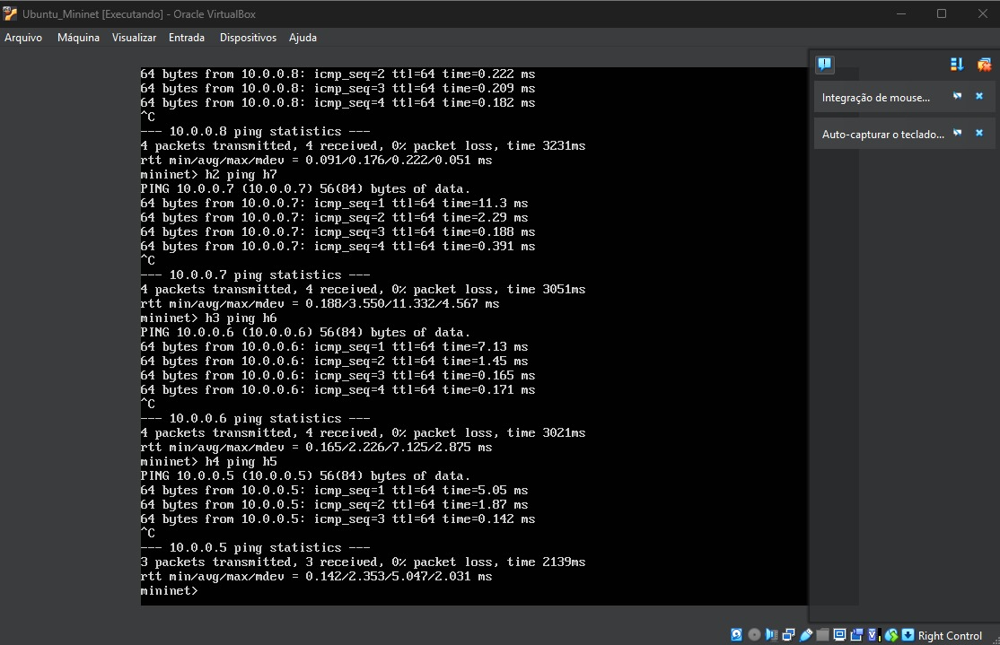

# Projeto de Topologia de Rede Customizada com Mininet
Este projeto utiliza o simulador de redes Mininet para criar uma topologia customizada composta por múltiplos switches e hosts, além de permitir testes de conectividade entre os hosts.

## Colaboradores
 - Victor Boaventura Souza Muniz
- Igor Nogueira Olivio

# Descrição
O projeto define uma topologia de rede com sete switches e sete hosts conectados de forma específica. O objetivo é simular o comportamento de uma rede e testar a comunicação entre os dispositivos, utilizando o Mininet para construir a topologia e verificar conectividade com comandos de ping.

# Questão 1









# Questão 2
## Estrutura da Topologia
- 7 Hosts: h1, h2, h3, h4, h5, h6, h7
- 7 Switches: s1, s2, s3, s4, s5, s6, s7
- Conexões: Cada host é conectado a um switch específico, e os switches são interconectados para formar a topologia.
- PDF com tabela de informações da topologia anexada no repositório (letra C)

## Objetivos
- Criar uma topologia customizada com switches e hosts.
- Executar testes de conectividade entre os hosts usando ping.
- Oferecer um CLI do Mininet para comandos adicionais e exploração da rede.

## Requisitos
- Mininet: Você pode instalar o Mininet utilizando o seguinte comando:
```
sudo apt-get install mininet
```
- Python 2.7 (compatível com o Mininet):
    - O Mininet por padrão utiliza o Python 2.7. Garanta que você está executando a versão correta.

## Arquivos
- `topo.py`: Script Python principal que define a topologia, inicia a rede, executa testes de ping e oferece o CLI para interações adicionais.

## Como Executar
1. Clonar o Repositório

Clone este repositório na sua máquina local:
```
git clone https://github.com/bsmvictor/MininetCustomTopology.git
cd MininetCustomTopology
```

2. Rodar o Script de Topologia

Execute o script topo.py para criar a topologia e testar a conectividade:
```
sudo python topo.py
```

## Estrutura do Código
- Classe MyTopo: Define a topologia personalizada com os hosts e switches conectados.
- Função run_topology: Inicializa o Mininet com a topologia, realiza testes de conectividade e abre o CLI para interações adicionais.

## Exemplo de Saída
Ao executar o script, você verá uma saída similar a esta:
```
*** Starting CLI:
mininet> pingall
*** Ping: testing ping reachability
h1 -> h2 h3 h4 h5 h6 h7
h2 -> h1 h3 h4 h5 h6 h7
...
```

## Observações
- Certifique-se de que está executando o script como superusuário (sudo), já que o Mininet requer permissões elevadas para configurar as interfaces e switches virtuais.
- Você pode expandir a topologia e modificar as conexões entre os switches e hosts conforme necessário para os seus experimentos.
